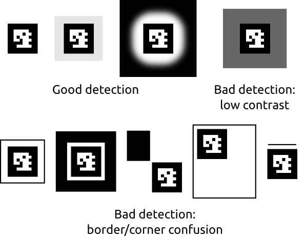

Chilitags, Robust Fiducial Markers for Augmented Reality
========================================================

Chilitags are a C++ cross-platform software library for the detection and
identification of 2D fiducial markers.  Their purpose is to be printed and
placed on objects from the real world, to form the basis or Augmented Reality
(AR) applications.  Using a camera, the position of the tagged objects can be
acquired by a computer and used to virtually display information on them.

Chilitags were developed internally for projects of the [CHILI
lab](http://chili.epfl.ch/) (Computer-Human Interaction in Learning and
Instruction, formerly CRAFT), such as
[Metroscope](http://craft.epfl.ch/lang/en/PaperTangibleInterface) or
[TapaCarp](http://chili.epfl.ch/page-92256-en.html).  There are already many
alternatives (e.g. [ARToolKit](http://www.hitl.washington.edu/artoolkit/), or
[reacTIVision](http://reactivision.sourceforge.net/), among many others), but
we decided to release Chilitags anyway, as there seemed to be a demand for it.

Overview
--------

### Features

The features of Chilitags come from their original use:

 * **Illumination tolerance:** Chilitags were developed for use in
   projector/camera systems, which required the detection to be robust to the
   illumination constraints of the projector.

 * **Precision:** Chilitags were used in applications to teach geometry, which
   required the detection to be as precise as possible to match the requirement
   on the quality of work of the students.

 * **Reliability:** Chilitags were used for long experiments in ecologically
   valid conditions, which required to build systems stable even in various,
   uncontrolled settings.

Chilitags can be recognized even from low resolution images (markers as narrow
as 20 pixels are recognized).  However, they are very sensitive to occlusions:
if a border is occluded, the tag will not be detected.

The [Chilitags demonstration video](http://youtu.be/WafWuJfEYbg) gives a worst
case scenario for the sample code running in real time on a single thread of an
Intel Core i7-620m, with a camera set for 960x720x30fps, in an unevenly lit,
large scene.

Other videos show real applications of CHilitags for reasearch in [tangible
learning](http://youtu.be/vnlLeCYxmCs) or [paper-based
interfaces](http://youtu.be/F_gSwHZ2u1Y).

### Content

This release of Chilitags consists of three components:

 * the library itself,

 * `detector`, the sample program illustrating how to use the library and used
   to generate the demonstration video.

 * `creator`, a utility to generate markers,

Chilitags have been developed on Linux (Ubuntu 64 bits), and are known to run
on Windows and MacOS X.

Getting Started
---------------

### Dependencies

Chilitags rely on OpenCV 2.  They have has been recently tested with OpenCV 2.3
and 2.4 on Ubuntu (64 bits) 12.10 and 13.04.  The [documentation on how to
install
OpenCV](http://docs.opencv.org/doc/tutorials/introduction/table_of_content_introduction/table_of_content_introduction.html)
can be found for various platforms and IDE.

### Set up

CMake can be used to generate configuration files of the most popular IDE's of
the main platforms.  A CMakeLists file is provided in the release.  Please
refer to [online documentation on how to use
CMake](http://www.cmake.org/cmake/help/runningcmake.html).

### Example

For example on Ubuntu, the software can be compiled via makefile with the
following commands:

 * `sudo apt-get install libopencv-dev cmake`

 to install the OpenCV libraries and cmake

 * `cmake .`

 in the root folder of this release to generate the makefile

 * `make`
 
 to compile `detector` and `creator` in the `bin` folder, linked against the
 `libchilitags.so` library in the `lib` folder.

 * `bin/detector` to start the sample program with default parameters for the camera.

### Markers Generation

Once the software is up and running, the markers can be generated using the
`creator` executable.  We also [generated sets of
markers](http://chili.epfl.ch/TODO) with various settings.

The `README` file accompanying `creator` gives important guidelines on how to
design and print chilitags.  It also explains the usage of `creator`.

The main design principles for tags are summarized below:

### Documentation

The documentation regarding the usage of `chilitags` is provided under the form
of the sample code `detector`.  Please refer to its `README` file and comments in
its source code.

Licence
-------

Chilitags is released under the LGPL3.

In short, it means that you can do more or less what you want with Chilitags,
as long as you publish the modifications you make to Chilitags under the same
terms (but you don't have to share the sources of the rest of your software).

You should also credit the authors.

We especially appreciate a reference in your paper, should you use Chilitags
for a research project.  Let us make that easy for you:

 * Chilitags, Robust Fiducial Markers for Augmented Reality. Q. Bonnard, G.
   Zufferey, A. Mazzei, S. Cuendet, N. Li, P. Dillenbourg. CHILI, EPFL,
   Switzerland. `http://chili.epfl.ch/`. 2013.

    @misc{chilitags,
        title = {Chilitags, Robust Fiducial Markers for Augmented Reality.},
        author={Q. Bonnard, G. Zufferey, A. Mazzei, S. Cuendet, N. Li, P. Dillenbourg},
        publisher={CHILI, EPFL, Switzerland},
        url={http://chili.epfl.ch/TODO},
        year={2013},
    }

Should you require an different licence, please contact [CHILI](http://chili.epfl.ch).

Contributing and Issues
-----------------------

This release intends to be minimal, with only the core functionality of
Chilitags: given an image, identify which tag is where.  Such a release is
especially adapted to developers who want to embed marker detection in their
C++ application.  More user-friendly releases (e.g. bindings to other
languages, TUIO wrapper, etc.) or additional features (tracking, calibration,
3D postions, etc.) may come in further releases.

Despite the efforts done to extract this release from "research code",
Chilitags can easily be improved on the software engineering level.  Chilitags
have been extensively used in the past years, but no proper tests have been
developed.  Documentation have been created only for this release, and can
probably be augmented.  The coding style can also be improved, especially
regarding the purity of the C++ regarding C aspects, or the use of legacy
features of OpenCV.  Contributions are very welcome.

